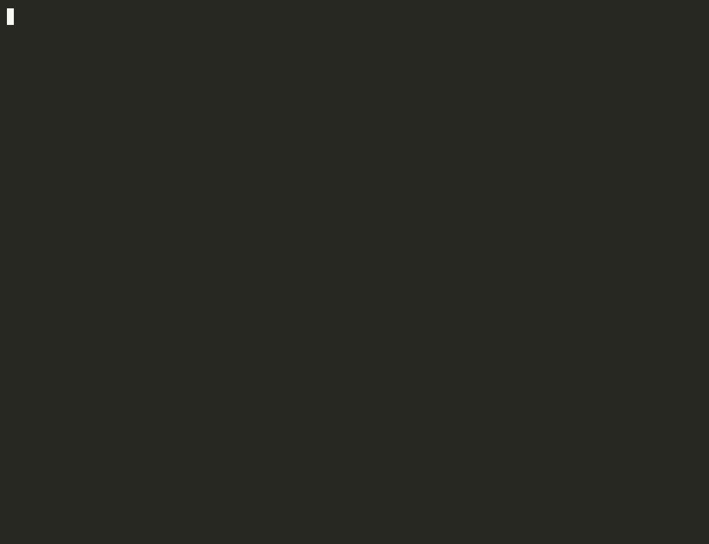

# CodeOS

[](https://github.com/richardshaba07-stack/codeos/actions)
[](LICENSE)

**Architectural intelligence layer for codebases.**

A **local, deterministic guardrail** that catches the moment an AI coding agent breaks
your architecture — with a citation, and exiting non-zero — and never guesses to do it:



CodeOS builds a **living semantic graph** of a codebase to answer two questions no
linter can ask:

- **"What breaks if I touch X?"** — the structural impact of a change.
- **"Why is it written this way?"** — the historical intent behind an architectural
  boundary.

The core thesis is **reading the negative space**: not what the code *does*, but what
it — systematically — *never does*. CodeOS applies that lens to four axes:

| Axis | Observable | Primitive |
|------|------------|-----------|
| **Structure** | which dependency edge never exists? | Layering invariants |
| **Time** | how many times could you have violated it, and abstained? | Abstention Field (Wilson lower bound) |
| **Intent** | what was the diff the instant the boundary was born? | Decision Fossils (from git history) |
| **Meta** | which invariant is *missing* where it should be? | 2nd-order Negative Space |

---

## Results

Everything below is **anti-false-positive**: a missing edge is better than one that
lies. The tool abstains rather than inventing.

- **Anti-fabrication, measured.** On real repositories, `learn` abstains on **~96%**
  of commits — it surfaces only genuine decisions (verbatim, with a cited source) and
  **refuses to invent the rest. Zero fabrications.** (Validated on `gin` (1,996 commits),
  `adr-tools`, and this repo — see [`benchmark/`](benchmark/).)
- **The recorded "why" changes agent behavior.** In a **blind, pre-registered**
  benchmark (n=36), an AI agent violated a non-derivable policy **18/18 times without**
  CodeOS's recorded intent — and **0/18 with it**. The full protocol, exact prompts,
  raw responses and the blind judge's verdicts are in **[`benchmark/`](benchmark/)** —
  verifiable, not on faith. Honest scope: a single model family (Claude) and synthetic
  substrates; cross-model generalization is future work.
- **Robust at scale.** Indexed **80 public repositories** (~3.5M entities) across the
  **9 supported languages, with 0 panics.**
- **9 languages**, 7 validated against compiler oracles (clang, ripper, swiftc,
  Roslyn, the Python `ast`, …).
- **364 tests**, green across the whole workspace.

> Honesty note: `certify`'s ✅ means "no architectural regression *detected* against
> the known invariants" — **not** "proven bug-free". A `⚠️` means *possible*, not
> certain. Same discipline everywhere.

---

## Install

Requirements: **Rust** (1.96+, via [rustup](https://rustup.rs)). All dependencies are
open source (MIT/Apache) and run **locally** — no paid service or API. `protoc` is
vendored, no manual install needed.

```bash
# Builds the server + CLI
cargo build --release -p codeos-rpc --bin codeos-server --bin codeos
```

Result: two executables in `target/release/`:

- `codeos-server` — the engine, behind a gRPC facade.
- `codeos` — the CLI to talk to it from the terminal.

---

## Quick start (CLI, no VS Code)

```bash
# 1. Start the server, attached to the git repo you want to analyze.
#    CODEOS_REPO enables the Abstention Field + Fossils (needs a repo with history).
CODEOS_REPO="$(pwd)" ./target/release/codeos-server &

# 2. Check everything is ready.
./target/release/codeos doctor

# 3. Index the project.
./target/release/codeos index .

# 4. Read the architectural report.
./target/release/codeos report

# 5. Ask for the minimal context an LLM needs for a hypothetical change.
./target/release/codeos query "what changes if I modify the parser?"
```

### CLI commands

`codeos help` lists them all; the main ones:

| Command | What it does |
|---------|--------------|
| `codeos index <path>` | Index the project (populates the semantic graph). |
| `codeos report` | Full architectural report across the four axes. |
| `codeos query "<text>"` | Generate the minimal relevant context for an LLM. |
| `codeos why "<a>\|<b>"` | Time machine: why the boundary between two elements exists. |
| `codeos impact <name>` | Who calls an entity (confirmed vs. possible). |
| `codeos context "<goal>"` | A "context pack" for a goal (`--for ai` for agents). |
| `codeos decide --title … --why …` | Manually record a decision in the intent ledger. |
| `codeos learn [path]` | **Fills** the ledger from the "why" already written (commits + ADRs). |
| `codeos audit [path]` | **Verifies** the ledger: vanished provenance (CI gate). |
| `codeos certify [--base --head]` | **Non-regression verdict** on a PR (CI gate). |
| `codeos mri` / `guard` / `simulate` | PR risk / firewall / refactoring what-if. |
| `codeos licenses` | Dependency licenses + ledger policy (`license-deny:`). |
| `codeos mcp` | MCP server over stdio: 10 native tools for AI agents. |
| `codeos doctor` | Diagnose address / port / server liveness. |

### Environment variables

| Variable | Default | Meaning |
|----------|---------|---------|
| `CODEOS_ADDR` | `127.0.0.1:50051` | gRPC server address (for both server and CLI). |
| `CODEOS_DB` | in-memory | Path to the graph's SQLite file (persistent if set). |
| `CODEOS_DECISIONS` | ephemeral | Directory of the Markdown intent ledger. |
| `CODEOS_REPO` | none | Git repo root: enables calibrated confidence + Fossils. |
| `RUST_LOG` | — | Log filter, e.g. `info` or `codeos_rpc=debug`. |

> **Note:** for Fossils and the Abstention Field, `CODEOS_REPO` must point to the
> **same** path you pass to `codeos index` (the git repo you're analyzing).

---

## The intent ledger: fill it, keep it true

The core of CodeOS is the **non-derivable** layer: the *why* git doesn't record.
Three commands fill it, keep it honest, and enforce it — all **anti-FP** (they never
invent: they cite the source and abstain when unsure) and at **zero cost** (read-only
git + files, no server connection for `learn`/`audit`).

```bash
# FILL: discover the "why" already written in history (commits + ADRs) and propose it
# as decisions, anchored to the modules the commit touched. Without --write it prints
# proposals to review.
codeos learn .                 # dry-run: what was decided here, and why
codeos learn . --write         # writes ONLY strong signals (markers/ADRs) to the ledger;
                               # the causal tier is noisier → --include-causal to write it too

# KEEP TRUE: flag decisions whose source has vanished (rewritten/squashed commit,
# deleted ADR file). Exits 1 if any → CI gate.
codeos audit .

# CERTIFY: reduce a PR's MRI to a binary verdict. Exits 1 on ⚠️.
codeos certify --base origin/main --head HEAD   # ✅ NO REGRESSION / ⚠️ REGRESSION POSSIBLE
```

- **In CI:** `templates/github-actions/codeos-certify.yml` comments every PR with the verdict.
- **For AI agents:** the MCP server (`codeos mcp`) exposes 10 tools, including
  `codeos_learn`, `codeos_audit`, `codeos_certify` — an agent discovers the why,
  verifies the ledger, and **self-certifies** *before* proposing code.

### "CodeOS Certified" badge

Add the seal to your repo's README:

```markdown
<!-- Static (for repos that run `certify` in CI): -->


<!-- Dynamic (reflects the branch's real state; needs templates/github-actions/codeos-badge.yml): -->

```

`codeos certify --badge` produces the endpoint JSON that feeds it. **Honesty:**
"certified" = "no architectural regression *detected*", not "proven safe".

---

## VS Code extension

The architectural immune system becomes **visible in the editor**: invariant
violations show up as `Diagnostic`s in the *Problems* panel, with the exact line,
plus toasts and a status bar item.

### Development (Extension Development Host)

The repo ships `.vscode/launch.json` and `.vscode/tasks.json`, so:

1. **Terminal → Run Task → `codeos: run server`** (builds and starts the server with `CODEOS_REPO` = this workspace).
2. Press **F5** → *"Run CodeOS extension"*: builds the extension and opens an Extension Development Host.
3. In the new window: **Command Palette (⇧⌘P) → "CodeOS: Index project"**, then **"CodeOS: Architectural report"**.

---

## Architecture

A Cargo workspace of 10 crates, in **onion** order (each crate depends only on the
earlier ones — invariant 1.5):

```
codeos-types      data model + event/command bus (the heart)
  ├─ codeos-storage   GraphStorage trait + SQLite (rusqlite bundled)
  ├─ codeos-parser    Tree-sitter: Python, Rust, TS, Go, Java, C, C++, Ruby, Swift, C# → raw data
codeos-graph      GraphResolver (name resolution → global EntityIds), GraphActor
codeos-memory     Decision store (versionable Markdown): the "why"
codeos-paleo      the Paleontologist: reads the negative space of TIME (git history)
codeos-guardian   immune system: discovers invariants from the negative space
codeos-query      QueryEngine: weighted BFS → minimal context for an LLM
codeos-core       Dispatcher + actor orchestration (Actor Model on Tokio)
codeos-rpc        gRPC facade (tonic) + the codeos-server / codeos binaries
```

Non-negotiable principles:

- **Actor Model**: commands over `mpsc`, events over a `broadcast` EventBus, a
  Dispatcher routes by command type. No actor references another directly (invariant 1.3).
- **The Parser never touches the graph** (invariant 1.4): it only mints raw data;
  global `EntityId`s are born in the `GraphResolver`.
- **Rules discovered, not configured**: layering invariants are *mined* from the
  asymmetry of dependencies, not hand-written.

---

## Status

**9 languages** supported (7 validated against compiler oracles). The intent ledger
**fills itself** (`learn`), **keeps itself true** (`audit`), and **enforces itself in
CI** (`certify`), all anti-false-positive. MCP server with **10 tools** for AI agents.
**364 tests** green across the workspace.

Cost: **0** — fully open source, runs locally, no paid API.

---

## License

[AGPL-3.0](LICENSE). You're free to use, study, modify and run it; if you distribute a
modified version — or run it as a network service — you must release your changes
under the same license.
